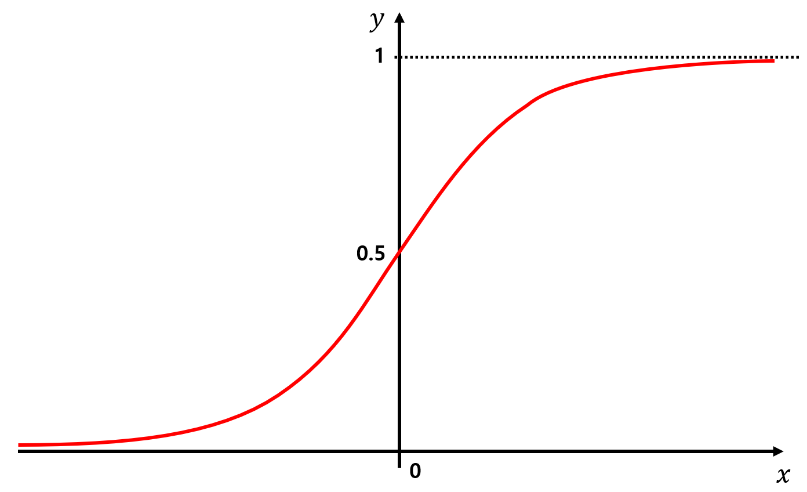
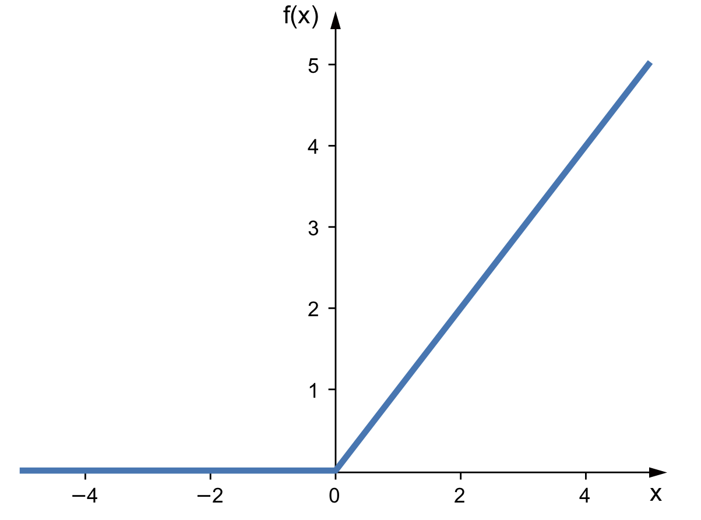
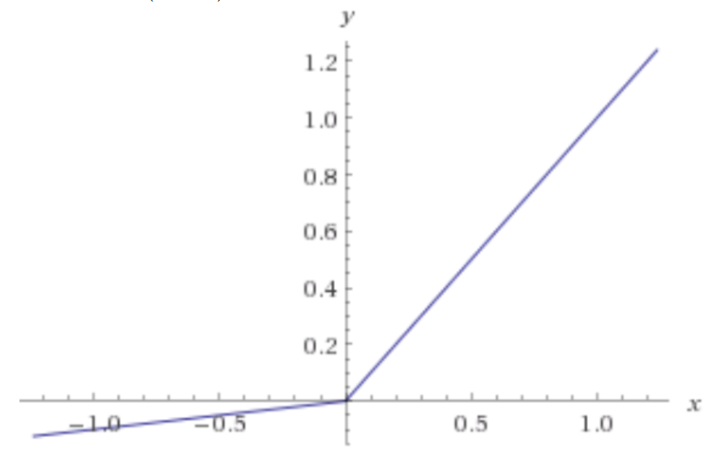
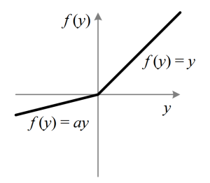
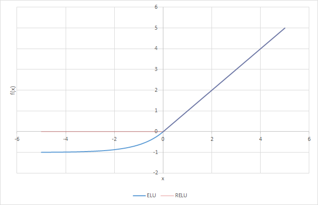
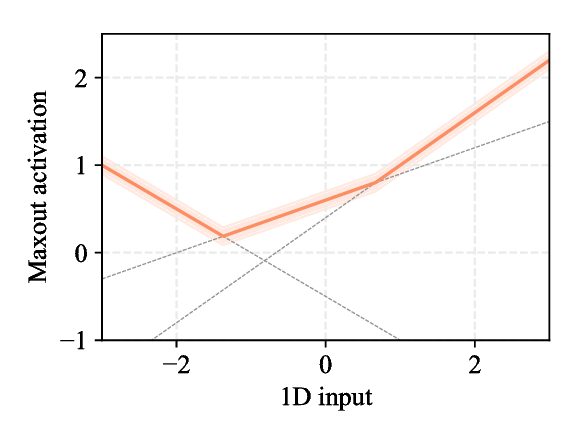

# DAVIAN Lab. Deep Learning Winter Study (2021)

- **Writer:** Yuri Kim

## Information

- **Title:** (cs231n) Lecture 7 : Training Neural Networks, part I
- **Link:** http://cs231n.stanford.edu/slides/2020/lecture_7.pdf
- **Keywords:** Activation functions, data processing, Batch Normalization, Transfer learning

## Details of training Neural Networks
- How do we set up our neural networks at the beginning?
- Which activation functions should we choose?
- How to preprocess the data
- Weight initialization, regularization and gradient checking
- Training dynamics (which include spcecific parameter update rules & hyperparemter optimization)
- Evaluation & model ensembles

## Activation Functions : 7 types

### 1. Sigmoid



- The **sigmoid** function takes each element and squashes it into the range of [0,1]
    Thus, if you get very high values as input, the output would be very near to 1. On the other hand for negative values, it will be near zero
- Saturation at 'firing rates' of a neuron

#### Problem
1. Saturated neurons can kill off the gradients : In the regions where the function is flat, the gradient will be 0. Hence when we multiply it with the upstream gradient, it will become very small and "kill" the gradient flow
2. Sigmoid outputs are not zero-centered : If the inputs are all positive, the gradients on the weights will all be in the same direction which gives very inefficient gradient updates

**Example)** When w(weights) is 2-dimensional, only two gradient update directions will be possible which will result in a **zig zag path** which is less efficient than if the optimal direction was directly followed

3. Calculating the exponential part of the sigmoid function is expensive

### 2. Tanh

- Tanh squashes each element into a range of [-1,1] : **zero-centered**

#### Problem
- However it still kills the gradient flow when saturated(flat)
&#8594; a bit better than sigmoid

### 3. ReLU
f(x)=max(0,x)

- It doesn't saturate in the positive region
- Computationally efficient
- Coverges about 6 times faster than sigmoid/tanh
- Biologically more plausible : closer approximation in neuroscience experiments

#### Problem
- Still not zero-centered
- The negative half is still saturated and kills the gradient
- **Dead ReLU** : will never activate and update
```
Reason 1. Bad initialization : weights can be off the data cloud and will never get input to activate
Reason 2. High learning rate : start off with a good ReLU but the updates are too huge and the weights jump around
→ ReLU units get knocked off the data manifold during training
```
> Initializing with slightly positive biases may increase the likelihood of it being active and more **firing** ReLUs

### 4. Leaky ReLU
f(x)=max(0.01x,x)

- No saturation at the negative space(No gradient dying problem)
- Computationally efficient
- Converges much faster than sigmoid/tanh

### 5. PReLU
f(x)=max(ax,x)

- Because the slope in the negative regime is trained as a parameter, it gives the model more flexibility

### 6. ELU
0&space;\\&space;&\alpha(exp(x)-1)&space;\text{&space;if&space;}&space;x\leq&space;0&space;\end{cases}" title="f(x)=\begin{cases} &x \text{ if } x>0 \\ &\alpha(exp(x)-1) \text{ if } x\leq 0 \end{cases}" />


- Closer to zero mean outputs
- Compared to leaky ReLU, it builds back to the negative saturation regime which adds more robustness to noise

### 7. Maxout Neuron



- Generalizes the ReLU and the Leaky ReLU
- Operating in a linear regime, it doesn’t saturate or die
</br> &#8594; However this doubles the number of parameters and neurons

&#8756; In conclusion, **use ReLU** with caution in adjusting learning rates. Also, try out other variants of it or tanh but don't use sigmoid.

## Data preprocessing
- Take the original data and zero-mean them and normalize it finally
- However when the inputs are all positive or biased, the gradients of the weights are all in the same direction and thus, we achieve *suboptimal optimization*(revisit the zigzag problem)

- **In practice** the zero-centering is done but not much of normalization since you have relatively comparable scale and distribution in pixels compared to more general machine learning problems that have very different scale
- Likely, PCA or whitening is not as common because it is more preferable to have the spatial structure over the original image
- For testing, we apply the same empirical mean that was used in training
---------------------------
### In practice for images
1. Subtract the mean image from each image which has the same size(ex. AlexNet)
2. Subtract per-channel mean: take the mean by channel(RGB) when it is similar across the whole image which is easier(ex. VGGNet)

## Weight Initialization
1. Small gaussian random numbers
    - When sd is **1e-2** : will be a problem as the network grows and becomes deeper
    </br> &#8594;As we multiply by w, the values quickly shrink and collapse and eventually all activation will become 0, thus no learning
    - When sd is **1** : weights are going to be very big which will have saturated regimes
    </br> &#8594;Local gradients will be 0, thus no learning
2. Xavier initialization
- The basic idea is that scale the weights by the number of the inputs so that the variance of the input should be the same as the variance of the output &#8594; **Unit Gaussian!**
- Problem : This does not hold for ReLU because half of them are zero and the variance will be too small
&#8594; Solution : Divide by an extra 2, adjusting for the fact that half the neurons get killed

## Batch normalization
**Force the activation to have unit gaussian activations** : normalize by the mean & std of each neuron
- Compute the empirical mean and var independently for each dimension and normalize by this
</br> &#8594; usually inserted **after** fc layers because in cnn when we multiply with W, it can result in bad scales and batch normalization can undo this effect

- For **convolution layers**, normalize jointly of both dimension *and* training examples so that nearby locations will be the same in line with the convolutional property &#8594; one mean and std per activation map
-----------------------------------------
### What if we want control over how much saturation to have?
We currently are basically constraining the regime into the tanh layer so that there is no saturation. But what if we may want saturation up to some extent?
- Additional parameters : &#947; and &#946;
> this allows to recover the identity function if we wanted to


### Conclusion


#### references
- 
