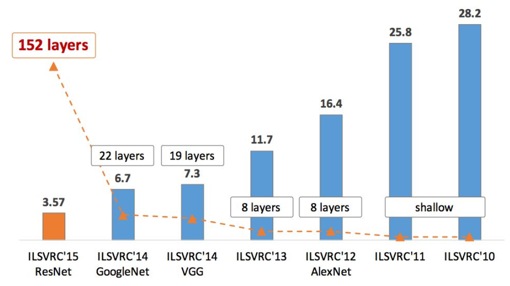
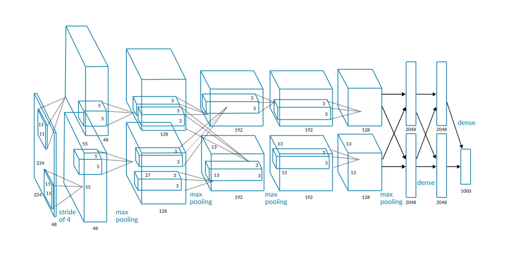
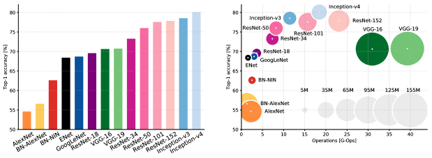
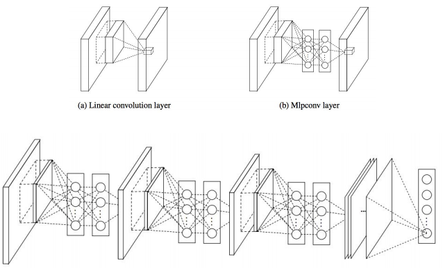
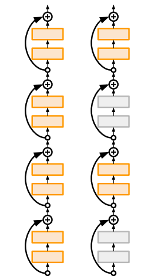
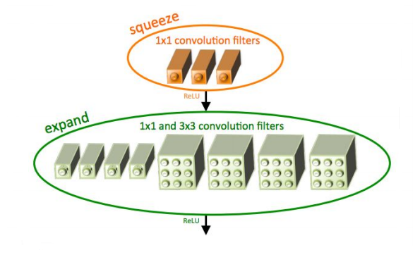

# DAVIAN Lab. Deep Learning Winter Study (2021)

- **Writer:** Dongmin You

## Information

- **Title:** (cs229) Lecture 9 : CNN Architectures
- **Link:** http://cs231n.stanford.edu/slides/2017/cs231n_2017_lecture9.pdf
- **Keywords:** AlexNet, VGGNet, GoogLeNet, ResNet, Network in Network, Wide ResNet, ResNeXT, Stochastic Depth, DenseNet, FractalNet, SqueezeNet

## Case Study
  : 연도별 정확도 차트(ILSVRC winners)
 
### 1. AlexNet (2012)
 - First large scale CNN able to do well ImageClassification model, 2pararelled gpu computing
 
 -ZFNet : improve hyperparameters
 !()(images/ZFNet.png)
 
### 2. VGGNet (2014)
 - Small filters, Deeper networks
 
 - Why use small filters?
 -> Stack of three 3x3 conv(stride 1) layers has same "Effective receptive field" as one 7x7 conv layer with deeper, more linearities, small parameters : 27 vs 49
 - Problems : too many parameters
 
### 3. GoogLeNet (2014)
 - Computational efficiency, inception modules, Bottleneck layers, Auxiliary classification outputs
 
 
 
### 4. ResNet (2015)
 - Revolutional deep 152 Layers, Residual Connections
 
 
 
  
## Other architectures to know

### 1. Network in Network (2014)
 
 
### 2. Wide ResNet (2016)
 
 
### 3. ResNeXt (2016)
 
 
### 4. Stochastic Depth (2016)
 
 
### 5. DenseNet (2017)
 
 
### 6. FractalNet (2017)
 
 
### 7. SqueezeNet (2017)
 
 
## Reference & Further readings
